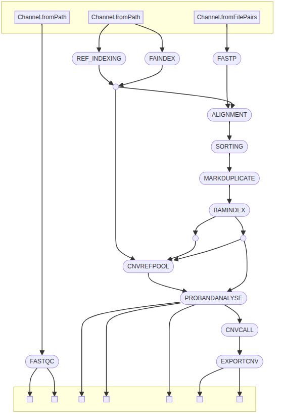
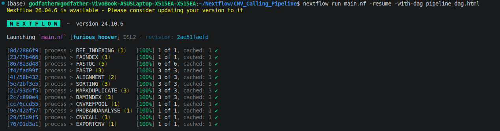

# Nextflow-CNVkit-Trio-Pipeline

A modular **Nextflow DSL2** pipeline for **trio-based Copy Number Variation (CNV) analysis** from paired-end whole-genome sequencing (WGS) data using **CNVkit**. The workflow performs quality control, read preprocessing, alignment, duplicate marking, CNV reference construction from parental samples, CNV analysis of the proband, CNV calling, and exports the final CNV calls in **BED** and **VCF** formats.

---

## Overview

This pipeline automates the complete CNV analysis workflow for a parent-offspring trio.

### Features

- Modular **Nextflow DSL2** implementation
- Docker-based reproducible execution
- FastQC quality assessment
- Fastp read trimming
- BWA-MEM2 alignment
- Samtools sorting and indexing
- GATK duplicate marking
- CNVkit reference construction using parental samples
- CNV calling for the proband
- Export CNVs to **BED** and **VCF**
- Easily extensible for downstream annotation

---

# Workflow



---

# Pipeline Architecture

```text
FASTQ
   │
   ▼
FASTQC
   │
   ▼
FASTP
   │
   ▼
ALIGNMENT
   │
   ▼
SORTING
   │
   ▼
MARKDUPLICATE
   │
   ▼
BAMINDEX
   │
   ├───────────────┐
   │               │
Parents         Proband
   │               │
   ▼               │
CNVREFPOOL         │
   │               │
   └───────┬───────┘
           ▼
   PROBANDANALYSE
           │
           ▼
       CNVCALL
           │
           ▼
      EXPORTCNV
      ├── BED
      └── VCF
```

---

# Dataset

This pipeline was developed and tested using the publicly available **CNVkit Trio Example Dataset** hosted on **Zenodo**.

### Sequencing Data

| Sample | Read 1 | Read 2 |
|---------|--------|--------|
| Father | https://zenodo.org/record/3243160/files/father_R1.fq.gz | https://zenodo.org/record/3243160/files/father_R2.fq.gz |
| Mother | https://zenodo.org/record/3243160/files/mother_R1.fq.gz | https://zenodo.org/record/3243160/files/mother_R2.fq.gz |
| Proband | https://zenodo.org/record/3243160/files/proband_R1.fq.gz | https://zenodo.org/record/3243160/files/proband_R2.fq.gz |

### Reference Genome

```
hg19_chr8.fa.gz
```

Download:

https://zenodo.org/record/3243160/files/hg19_chr8.fa.gz

These files originate from the CNVkit example dataset and provide a small chromosome-specific dataset suitable for learning and testing CNV analysis workflows. :contentReference[oaicite:0]{index=0}

---

# Expected Directory Structure

```
project/
│
├── data/
│   ├── father_R1.fq.gz
│   ├── father_R2.fq.gz
│   ├── mother_R1.fq.gz
│   ├── mother_R2.fq.gz
│   ├── proband_R1.fq.gz
│   └── proband_R2.fq.gz
│
├── assets/
│   └── hg19_chr8.fa.gz
│
├── modules/
├── main.nf
└── nextflow.config
```

---

# Modules

| Module | Description |
|----------|-------------|
| REF_INDEXING | Builds the BWA reference index |
| FAINDEX | Creates FASTA index |
| FASTQC | Performs quality assessment |
| FASTP | Adapter trimming and quality filtering |
| ALIGNMENT | Aligns reads using BWA-MEM2 |
| SORTING | Coordinate sorting of BAM files |
| MARKDUPLICATE | Marks PCR duplicates using GATK |
| BAMINDEX | Generates BAM index (.bai) |
| CNVREFPOOL | Builds pooled CNV reference from parental BAMs |
| PROBANDANALYSE | Performs CNV analysis on the proband |
| CNVCALL | Calls copy number variants |
| EXPORTCNV | Exports CNVs in BED and VCF formats |

---

# Software Used

| Software | Purpose |
|-----------|---------|
| Nextflow DSL2 | Workflow management |
| Docker | Reproducible execution |
| FastQC | Read quality control |
| Fastp | Read trimming |
| BWA-MEM2 | Read alignment |
| Samtools | BAM processing |
| GATK | Duplicate marking |
| CNVkit | CNV detection and analysis |

---

# Installation

Clone the repository

```bash
git clone https://github.com/rahuls472/Nextflow-CNVkit-Trio-Pipeline.git

cd Nextflow-CNVkit-Trio-Pipeline
```

---

# Run the Pipeline

```bash
nextflow run main.nf -resume
```

Generate workflow reports

```bash
nextflow run main.nf \
    -resume \
    -with-dag pipeline_dag.html \
    -with-report report.html \
    -with-timeline timeline.html
```

---

# Pipeline Execution



---

# Output

The pipeline produces:

```
results/

├── fastqc/
├── fastp/
├── alignment/
├── sorting/
├── markduplicate/
├── bamindex/
├── cnv_reference/
├── analyse/
├── cnv_call/
└── export/
    ├── *.bed
    └── *.vcf
```

---

# Repository Structure

```
Nextflow-CNVkit-Trio-Pipeline/

├── modules/
├── Screenshots/
├── assets/
├── data/
├── main.nf
├── nextflow.config
├── README.md
└── .gitignore
```

---

# Future Improvements

- MultiQC integration
- AnnotSV annotation
- Sample sheet support
- nf-core compatible configuration
- Automated HTML summary report

---

# Acknowledgements

- **CNVkit** for copy number variation analysis and workflow concepts. :contentReference[oaicite:1]{index=1}
- The **Zenodo CNVkit example dataset**, which provides the trio sequencing data and reference genome used to develop and test this pipeline. :contentReference[oaicite:2]{index=2}

---

# Author

**Rahul Kumar Singh**

M.Sc. Bioinformatics

GitHub: https://github.com/rahuls472
